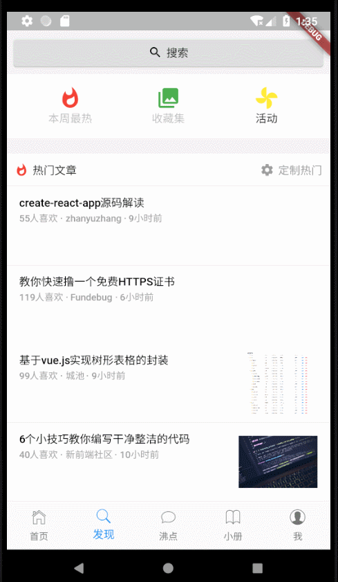
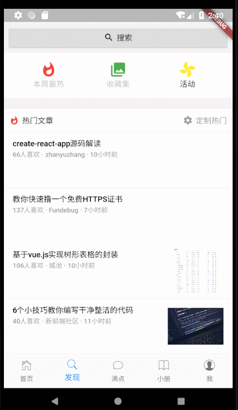

# Flutter入门——山寨掘金（二）

### 写在前面

上篇文章我们实现了首页和文章详情页，今天我们继续。

#### 一. 实现发现页

打开 ```discovery.dart``` ，可以删掉之前写的代码，或者在原来的基础上改造也可以，看大家喜欢，首先在顶部引入需要用的包和其他文件：

```dart
import 'package:flutter/material.dart';
import 'package:flutter/cupertino.dart';
import 'dart:async';
import 'dart:convert';
import 'package:http/http.dart' as http;
import '../utils/countTime.dart';
import '../config/httpHeaders.dart';
```
在这里我引入了一个 ```countTime.dart``` 文件，这个是我们用来计算文章发布时间与当前的差值的，我们先把这个小工具实现一下。在 ```lib``` 文件夹下新建 ```utils``` 文件夹，并在其中新建 ```countTime.dart``` 文件，写入以下代码：

```dart
//计算发布时间间隔
String countTime(String timestamp) {
  var now = new DateTime.now();
  var publicTime = DateTime.parse(timestamp);
  var diff = now.difference(publicTime);
  if (diff.inDays > 0) {
    return '${diff.inDays}天前';
  } else if (diff.inHours > 0) {
    return '${diff.inHours}小时前';
  } else if (diff.inMinutes > 0) {
    return '${diff.inMinutes}分钟前';
  } else if (diff.inSeconds > 0) {
    return '${diff.inSeconds}秒前';
  }
  return timestamp.substring(0, timestamp.indexOf('T'));
}

```

上面的代码通过传入的时间戳来计算差值，并返回不同的文本，比较简单，只要小伙伴们熟悉一下语法就会了。

回到 ```discovery.dart``` 继续我们的代码，将上一篇文章中网络请求的写法改一下：

```dart
/*接着写*/
class DiscoveryPage extends StatefulWidget {
  @override
  DiscoveryPageState createState() => new DiscoveryPageState();
}

class DiscoveryPageState extends State<DiscoveryPage> {
  List hotArticles;

  Future getHotArticles() {
    return http.get(Uri.encodeFull(
        'https://timeline-merger-ms.juejin.im/v1/get_entry_by_rank?src=${httpHeaders['X-Juejin-Src']}&uid=${httpHeaders['X-Juejin-Uid']}&device_id=${httpHeaders['X-Juejin-Client']}&token=${httpHeaders['X-Juejin-Token']}&limit=20&category=all&recomment=1'));
  }

  @override
  void initState() {
    super.initState();
    this.getHotArticles().then((response) {
      setState(() {
        hotArticles = json.decode(response.body)['d']['entrylist'];
      });
    }, onError: (e) {
      throw Exception('Failed to load data');
    });
  }
}
```

```initState``` 用来做初始化，写过 ```react``` 的同志应该很熟悉了。接着是 ```then``` ，是不是和 ```Promise``` 很像？

上一篇文章中我们构建页面用的主要是  ```ListView``` ，既然是入门教程，我们今天就用新的组件，多熟悉一些东西。接着写：

```dart
class DiscoveryPageState extends State<DiscoveryPage> {
  /*接着写*/
    @override
    Widget build(BuildContext context) {
      // TODO: implement build
      return CustomScrollView(
        slivers: <Widget>[
          new SliverAppBar(
            pinned: true,
            title: new Card(
                color: new Color.fromRGBO(250, 250, 250, 0.6),
                child: new FlatButton(
                  onPressed: () {
                    Navigator.pushNamed(context, '/search');
                  },
                  child: new Row(
                    mainAxisAlignment: MainAxisAlignment.center,
                    crossAxisAlignment: CrossAxisAlignment.center,
                    children: <Widget>[
                      new Icon(
                        Icons.search,
                        color: Colors.black,
                      ),
                      new Padding(padding: new EdgeInsets.only(right: 5.0)),
                      new Text('搜索')
                    ],
                  ),
                )),
            titleSpacing: 5.0,
            backgroundColor: new Color.fromRGBO(244, 245, 245, 1.0),
          ),
          new SliverList(
              delegate: new SliverChildBuilderDelegate((context, index) {
            return new Container(
              color: Colors.white,
              padding: new EdgeInsets.only(top: 15.0,bottom: 15.0),
              margin: new EdgeInsets.only(bottom: 20.0),
              child: new Row(
                mainAxisAlignment: MainAxisAlignment.spaceEvenly,
                crossAxisAlignment: CrossAxisAlignment.center,
                children: <Widget>[
                  new FlatButton(
                      onPressed: null,
                      child: new Column(
                        children: <Widget>[
                          new Icon(
                            Icons.whatshot,
                            color: Colors.red,
                            size: 30.0,
                          ),
                          new Text('本周最热')
                        ],
                      )),
                  new FlatButton(
                      onPressed: null,
                      child: new Column(
                        children: <Widget>[
                          new Icon(
                            Icons.collections,
                            color: Colors.green,
                            size: 30.0,
                          ),
                          new Text('收藏集')
                        ],
                      )),
                  new FlatButton(
                      onPressed: () {
                        Navigator.pushNamed(context, '/activities');
                      },
                      child: new Column(
                        children: <Widget>[
                          new Icon(
                            Icons.toys,
                            color: Colors.yellow,
                            size: 30.0,
                          ),
                          new Text('活动')
                        ],
                      )),
                ],
              ),
            );
          }, childCount: 1)),
          new SliverList(
              delegate: new SliverChildBuilderDelegate((context, index) {
            return new Container(
              padding: new EdgeInsets.all(10.0),
              decoration: new BoxDecoration(
                  border: new Border(
                      bottom: new BorderSide(width: 0.2, color: Colors.grey)),
                  color: Colors.white),
              child: new Row(
                mainAxisAlignment: MainAxisAlignment.spaceBetween,
                crossAxisAlignment: CrossAxisAlignment.center,
                children: <Widget>[
                  new Row(
                    mainAxisAlignment: MainAxisAlignment.start,
                    crossAxisAlignment: CrossAxisAlignment.center,
                    children: <Widget>[
                      new Icon(
                        Icons.whatshot,
                        color: Colors.red,
                      ),
                      new Padding(padding: new EdgeInsets.only(right: 5.0)),
                      new Text(
                        '热门文章',
                        style: new TextStyle(fontSize: 14.0),
                      )
                    ],
                  ),
                  new Row(
                    children: <Widget>[
                      new Icon(
                        Icons.settings,
                        color: Colors.grey,
                      ),
                      new Padding(padding: new EdgeInsets.only(right: 5.0)),
                      new Text(
                        '定制热门',
                        style: new TextStyle(fontSize: 14.0, color: Colors.grey),
                      )
                    ],
                  )
                ],
              ),
            );
          }, childCount: 1)),
          new SliverFixedExtentList(
              itemExtent: 100.0,
              delegate: new SliverChildBuilderDelegate((context, index) {
                var itemInfo = hotArticles[index];
                return createItem(itemInfo);
              }, childCount: hotArticles == null ? 0 : hotArticles.length)),
        ],
      );
    }
}
```

这里我们用的 ```CustomScrollView``` 和 ```Sliver```，语法啥的小伙伴们自己看文章了哈，就不解释了。对于搜索按钮和活动按钮，我这里已经写了跳转路由，不急，我们一会儿就去实现。我们把单个文章的构建代码提出来，让整体简洁一点。

```dart
class DiscoveryPageState extends State<DiscoveryPage> {
  /*接着写*/
  //单个热门文章
    Widget createItem(itemInfo) {
      var publicTime = countTime(itemInfo['createdAt']);
      return new Container(
        padding: new EdgeInsets.only(top: 10.0, bottom: 10.0),
        decoration: new BoxDecoration(
            color: Colors.white,
            border: new Border(
                bottom: new BorderSide(width: 0.2, color: Colors.grey))),
        child: new FlatButton(
            onPressed: null,
            child: new Row(
              mainAxisAlignment: MainAxisAlignment.spaceBetween,
              crossAxisAlignment: CrossAxisAlignment.center,
              children: <Widget>[
                new Expanded(
                  child: new Column(
                    crossAxisAlignment: CrossAxisAlignment.start,
                    children: <Widget>[
                      new Text(
                        itemInfo['title'],
                        textAlign: TextAlign.left,
                        style: new TextStyle(
                          color: Colors.black,
                        ),
                        maxLines: 2,
                        overflow: TextOverflow.ellipsis,
                      ),
                      new Text(
                        '${itemInfo['collectionCount']}人喜欢 · ${itemInfo['user']['username']} · $publicTime',
                        textAlign: TextAlign.left,
                        style: new TextStyle(color: Colors.grey, fontSize: 12.0),
                        softWrap: true,
                      )
                    ],
                  ),
                ),
                itemInfo['screenshot'] != null
                    ? new Image.network(
                        itemInfo['screenshot'],
                        width: 100.0,
                      )
                    : new Container(
                        width: 0.0,
                        height: 0.0,
                      )
              ],
            )),
      );
    }
}
```
这里的单个文章有可能没有截图，所以写个判断。现在运行一下，如果你看到的界面长这样，就OK了：



#### 二. 实现搜索页

我们先实现搜索页，在 ```pages``` 下新建 ```search.dart``` ，写入下列代码：

```dart
import 'package:flutter/material.dart';
import 'package:flutter/cupertino.dart';
import 'package:http/http.dart' as http;
import 'dart:convert';
import 'dart:async';
import '../utils/countTime.dart';

class SearchPage extends StatefulWidget {
  @override
  SearchPageState createState() => new SearchPageState();
}

class SearchPageState extends State<SearchPage> {
  String searchContent;
  List searchResult;

  Future search(String query) {
    return http.get(
        'https://search-merger-ms.juejin.im/v1/search?query=$query&page=0&raw_result=false&src=web');
  }

  final TextEditingController controller = new TextEditingController();
}

```

这里我们申明两个变量 ```searchContent``` 和 ```searchResult``` ，前者是搜索内容，后者是结果列表，再申明一个 ```controller``` 用于控制输入框。

> 看文档啊，同志们！

接着构建页面：

```dart
class SearchPageState extends State<SearchPage> {
/*接着写*/
  @override
  Widget build(BuildContext context) {
    // TODO: implement build
    return new CustomScrollView(
      slivers: <Widget>[
        new SliverAppBar(
            pinned: true,
            leading: new IconButton(
                icon: new Icon(Icons.chevron_left),
                onPressed: () {
                  Navigator.pop(context);
                }),
            title: new Text(
              '搜索',
              style: new TextStyle(fontWeight: FontWeight.normal),
            ),
            centerTitle: true,
            iconTheme: new IconThemeData(color: Colors.blue),
            backgroundColor: new Color.fromRGBO(244, 245, 245, 1.0),
            bottom: new PreferredSize(
                child: new Container(
                  color: Colors.white,
                  padding: new EdgeInsets.all(5.0),
                  child: new Card(
                      color: new Color.fromRGBO(252, 252, 252, 0.6),
                      child: new Padding(
                        padding: new EdgeInsets.all(5.0),
                        child: new Row(
                          crossAxisAlignment: CrossAxisAlignment.center,
                          mainAxisAlignment: MainAxisAlignment.spaceBetween,
                          children: <Widget>[
                            new Expanded(
                              child: new TextField(
                                autofocus: true,
                                style: new TextStyle(
                                    fontSize: 14.0, color: Colors.black),
                                decoration: new InputDecoration(
                                  contentPadding: new EdgeInsets.all(0.0),
                                  border: InputBorder.none,
                                  hintText: '搜索',
                                  prefixIcon: new Icon(
                                    Icons.search,
                                    size: 16.0,
                                    color: Colors.grey,
                                  ),
                                ),
                                onChanged: (String content) {
                                  setState(() {
                                    searchContent = content;
                                  });
                                },
                                onSubmitted: (String content) {
                                  search(content).then((response) {
                                    setState(() {
                                      searchResult =
                                          json.decode(response.body)['d'];
                                    });
                                  }, onError: (e) {
                                    throw Exception('Failed to load data');
                                  });
                                },
                                controller: controller,
                              ),
                            ),
                            searchContent == ''
                                ? new Container(
                                    height: 0.0,
                                    width: 0.0,
                                  )
                                : new InkResponse(
                                    child: new Icon(
                                      Icons.close,
                                    ),
                                    onTap: () {
                                      setState(() {
                                        searchContent = '';
                                        controller.text = '';
                                      });
                                    })
                          ],
                        ),
                      )),
                ),
                preferredSize: new Size.fromHeight(40.0))),
        searchResult == null
            ? new SliverFillRemaining(
                child: new Container(
                  color: Colors.white,
                ),
              )
            : new SliverList(
                delegate: new SliverChildBuilderDelegate((context, index) {
                var resultInfo = searchResult[index];
                return showResult(resultInfo);
              }, childCount: searchResult.length))
      ],
    );
  }
}

```

这里没什么特别的，小伙伴们看看代码就懂了，我们还是把搜索结果单独提出来：

```dart
class SearchPageState extends State<SearchPage> {
/*接着写*/
//显示搜索结果
  Widget showResult(resultInfo) {
    var publicTime = countTime(resultInfo['createdAt']);
    return new Container(
      alignment: Alignment.centerLeft,
      padding: new EdgeInsets.all(10.0),
      decoration: new BoxDecoration(
          color: Colors.white,
          border: new Border(
              bottom: new BorderSide(width: 0.2, color: Colors.grey))),
      child: new FlatButton(
          onPressed: null,
          child: new Column(
            crossAxisAlignment: CrossAxisAlignment.start,
            mainAxisAlignment: MainAxisAlignment.start,
            children: <Widget>[
              new Text(
                resultInfo['title'],
                style: new TextStyle(color: Colors.black),
              ),
              new Text(
                '${resultInfo['collectionCount']}人喜欢 · ${resultInfo['user']['username']} · $publicTime',
                textAlign: TextAlign.left,
                style: new TextStyle(color: Colors.grey, fontSize: 12.0),
                softWrap: true,
              )
            ],
          )),
    );
  }
}

```

至此，搜索页面写完了，别忙运行啊，还没写路由呢。打开 ```main.dart```，引入 ```search.dart``` ，然后配置一下路由：

```dart
import 'package:flutter/material.dart';
import 'pages/index.dart';
import 'pages/search.dart';

void main() => runApp(new MyApp());

class MyApp extends StatelessWidget {
  @override
  Widget build(BuildContext context) {
    return new MaterialApp(
      home: new IndexPage(),
      theme: new ThemeData(
          highlightColor: Colors.transparent,
          //将点击高亮色设为透明
          splashColor: Colors.transparent,
          //将喷溅颜色设为透明
          bottomAppBarColor: new Color.fromRGBO(244, 245, 245, 1.0),
          //设置底部导航的背景色
          scaffoldBackgroundColor: new Color.fromRGBO(244, 245, 245, 1.0),
          //设置页面背景颜色
          primaryIconTheme: new IconThemeData(color: Colors.blue),
          //主要icon样式，如头部返回icon按钮
          indicatorColor: Colors.blue,
          //设置tab指示器颜色
          iconTheme: new IconThemeData(size: 18.0),
          //设置icon样式
          primaryTextTheme: new TextTheme(
              //设置文本样式
              title: new TextStyle(color: Colors.black, fontSize: 16.0))),
      routes: <String, WidgetBuilder>{
        '/search': (BuildContext context) => SearchPage()
      },
    );
  }
}
```

现在可以运行了，效果如下：点击进入搜索详情页我就不做了，这些都留给小伙伴们练手吧：


#### 三. 实现活动页

活动页的实现和首页一模一样，代码我就不贴了，在 ```main.dart``` 配置一下就行：

```dart
import 'package:flutter/material.dart';
import 'pages/index.dart';
import 'pages/search.dart';
import 'pages/activities.dart';
void main() => runApp(new MyApp());

class MyApp extends StatelessWidget {
  @override
  Widget build(BuildContext context) {
    return new MaterialApp(
      home: new IndexPage(),
      theme: new ThemeData(
          highlightColor: Colors.transparent,
          //将点击高亮色设为透明
          splashColor: Colors.transparent,
          //将喷溅颜色设为透明
          bottomAppBarColor: new Color.fromRGBO(244, 245, 245, 1.0),
          //设置底部导航的背景色
          scaffoldBackgroundColor: new Color.fromRGBO(244, 245, 245, 1.0),
          //设置页面背景颜色
          primaryIconTheme: new IconThemeData(color: Colors.blue),
          //主要icon样式，如头部返回icon按钮
          indicatorColor: Colors.blue,
          //设置tab指示器颜色
          iconTheme: new IconThemeData(size: 18.0),
          //设置icon样式
          primaryTextTheme: new TextTheme(
              //设置文本样式
              title: new TextStyle(color: Colors.black, fontSize: 16.0))),
      routes: <String, WidgetBuilder>{
        '/search': (BuildContext context) => SearchPage(),
        '/activities': (BuildContext context) => ActivitiesPage(),
      },
    );
  }
}

```

效果如下：



### 结尾叨叨

今天的内容不多，主要使用了新的组件和新的请求写法，小伙伴们想实现什么功能就动手吧，多多练习，今天就到这里了。